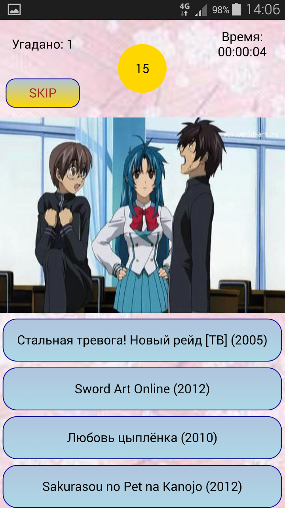
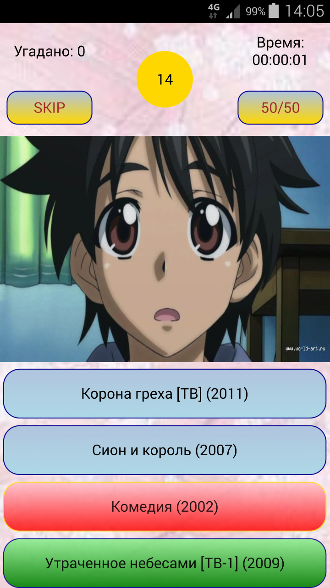

# AnimeQuiz
####Игра "Угадай аниме". Разработана на Qt5/QtQuick2 QML.
  
####В игре требуется отгадать название аниме по скриншоту из 4 предложенных вариантов.
####Доступные платформы: Windows, Android, Debian
####В папке Install находятся установочные файлы. [Инструкция по установке](https://github.com/iNomaD/AnimeQuiz/wiki/%D0%A3%D1%81%D1%82%D0%B0%D0%BD%D0%BE%D0%B2%D0%BA%D0%B0).
